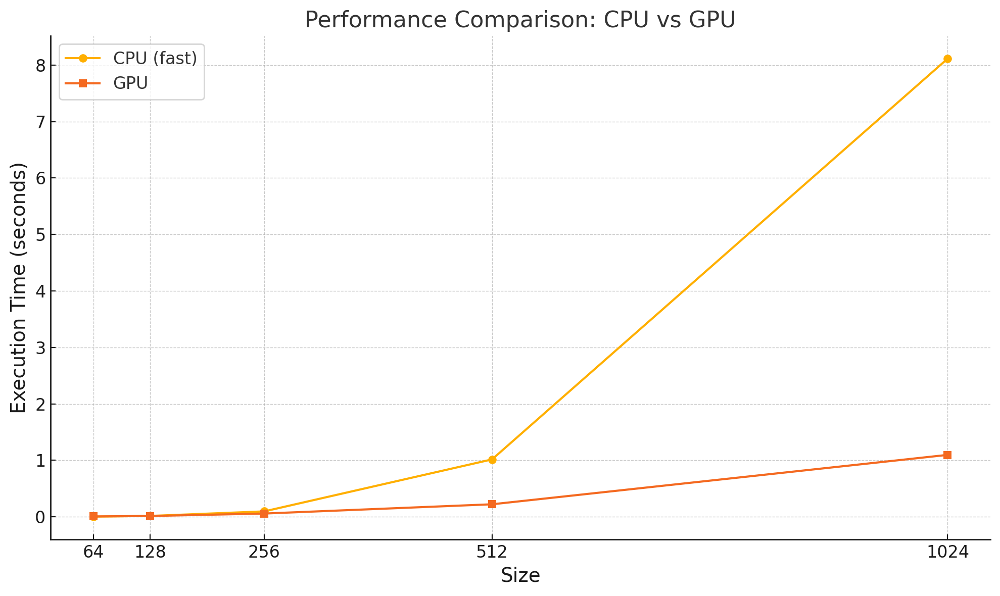

# MiniTorch Module 3


* Docs: https://minitorch.github.io/

* Overview: https://minitorch.github.io/module3.html


You will need to modify `tensor_functions.py` slightly in this assignment.

* Tests:

```
python run_tests.py
```

* Note:

Several of the tests for this assignment will only run if you are on a GPU machine and will not
run on github's test infrastructure. Please follow the instructions to setup up a colab machine
to run these tests.

This assignment requires the following files from the previous assignments. You can get these by running

```bash
python sync_previous_module.py previous-module-dir current-module-dir
```

The files that will be synced are:

        minitorch/tensor_data.py minitorch/tensor_functions.py minitorch/tensor_ops.py minitorch/operators.py minitorch/scalar.py minitorch/scalar_functions.py minitorch/module.py minitorch/autodiff.py minitorch/module.py project/run_manual.py project/run_scalar.py project/run_tensor.py minitorch/operators.py minitorch/module.py minitorch/autodiff.py minitorch/tensor.py minitorch/datasets.py minitorch/testing.py minitorch/optim.py


# TASK 3.1:

Parallel check output:
```
MAP

================================================================================
 Parallel Accelerator Optimizing:  Function tensor_map.<locals>._map,
/Users/tungnguyen/Documents/cornell/MLE/mod3-tungdnguyen/minitorch/fast_ops.py
(168)
================================================================================


Parallel loop listing for  Function tensor_map.<locals>._map, /Users/tungnguyen/Documents/cornell/MLE/mod3-tungdnguyen/minitorch/fast_ops.py (168)
---------------------------------------------------------------------------------------------|loop #ID
    def _map(                                                                                |
        out: Storage,                                                                        |
        out_shape: Shape,                                                                    |
        out_strides: Strides,                                                                |
        in_storage: Storage,                                                                 |
        in_shape: Shape,                                                                     |
        in_strides: Strides,                                                                 |
    ) -> None:                                                                               |
        is_stride_aligned =  stride_aligned(out_strides, in_strides, out_shape, in_shape)    |
        if is_stride_aligned:                                                                |
            for i in prange(len(out)):-------------------------------------------------------| #0
                out[i] = fn(in_storage[i])                                                   |
        else:                                                                                |
            for i in prange(len(out)):          ---------------------------------------------| #1
                out_index: Index  = np.empty(MAX_DIMS, dtype=np.int32)                       |
                in_index: Index  = np.empty(MAX_DIMS, dtype=np.int32)                        |
                to_index(i, out_shape, out_index)                                            |
                broadcast_index(out_index, out_shape, in_shape, in_index)                    |
                in_pos = index_to_position(in_index, in_strides)                             |
                out_pos = index_to_position(out_index, out_strides)                          |
                out[out_pos] = fn(in_storage[in_pos])                                        |
        return None                                                                          |
--------------------------------- Fusing loops ---------------------------------
Attempting fusion of parallel loops (combines loops with similar properties)...
Following the attempted fusion of parallel for-loops there are 2 parallel for-
loop(s) (originating from loops labelled: #0, #1).
--------------------------------------------------------------------------------
----------------------------- Before Optimisation ------------------------------
--------------------------------------------------------------------------------
------------------------------ After Optimisation ------------------------------
Parallel structure is already optimal.
--------------------------------------------------------------------------------
--------------------------------------------------------------------------------

---------------------------Loop invariant code motion---------------------------
Allocation hoisting:
The memory allocation derived from the instruction at
/Users/tungnguyen/Documents/cornell/MLE/mod3-tungdnguyen/minitorch/fast_ops.py
(182) is hoisted out of the parallel loop labelled #1 (it will be performed
before the loop is executed and reused inside the loop):
   Allocation:: out_index: Index  = np.empty(MAX_DIMS, dtype=np.int32)
    - numpy.empty() is used for the allocation.
The memory allocation derived from the instruction at
/Users/tungnguyen/Documents/cornell/MLE/mod3-tungdnguyen/minitorch/fast_ops.py
(183) is hoisted out of the parallel loop labelled #1 (it will be performed
before the loop is executed and reused inside the loop):
   Allocation:: in_index: Index  = np.empty(MAX_DIMS, dtype=np.int32)
    - numpy.empty() is used for the allocation.
None
ZIP

================================================================================
 Parallel Accelerator Optimizing:  Function tensor_zip.<locals>._zip,
/Users/tungnguyen/Documents/cornell/MLE/mod3-tungdnguyen/minitorch/fast_ops.py
(217)
================================================================================


Parallel loop listing for  Function tensor_zip.<locals>._zip, /Users/tungnguyen/Documents/cornell/MLE/mod3-tungdnguyen/minitorch/fast_ops.py (217)
----------------------------------------------------------------------------------------------------------------------------------------------------------|loop #ID
    def _zip(                                                                                                                                             |
        out: Storage,                                                                                                                                     |
        out_shape: Shape,                                                                                                                                 |
        out_strides: Strides,                                                                                                                             |
        a_storage: Storage,                                                                                                                               |
        a_shape: Shape,                                                                                                                                   |
        a_strides: Strides,                                                                                                                               |
        b_storage: Storage,                                                                                                                               |
        b_shape: Shape,                                                                                                                                   |
        b_strides: Strides,                                                                                                                               |
    ) -> None:                                                                                                                                            |
        is_stride_aligned =  stride_aligned(out_strides, a_strides, out_shape, a_shape) and stride_aligned(out_strides, b_strides, out_shape, b_shape)    |
        if is_stride_aligned:                                                                                                                             |
            for i in prange(len(out)):--------------------------------------------------------------------------------------------------------------------| #2
                out[i] = fn(a_storage[i], b_storage[i])                                                                                                   |
        else:                                                                                                                                             |
            for i in prange(len(out)):--------------------------------------------------------------------------------------------------------------------| #3
                out_index: Index = np.empty(MAX_DIMS, dtype=np.int32)                                                                                     |
                a_index: Index  = np.empty(MAX_DIMS, dtype=np.int32)                                                                                      |
                b_index: Index  = np.empty(MAX_DIMS, dtype=np.int32)                                                                                      |
                to_index(i, out_shape, out_index)                                                                                                         |
                broadcast_index(out_index, out_shape, a_shape, a_index)                                                                                   |
                broadcast_index(out_index, out_shape, b_shape, b_index)                                                                                   |
                a_pos = index_to_position(a_index, a_strides)                                                                                             |
                b_pos = index_to_position(b_index, b_strides)                                                                                             |
                out_pos = index_to_position(out_index, out_strides)                                                                                       |
                out[out_pos] = fn(a_storage[a_pos], b_storage[b_pos])                                                                                     |
        return None                                                                                                                                       |
--------------------------------- Fusing loops ---------------------------------
Attempting fusion of parallel loops (combines loops with similar properties)...
Following the attempted fusion of parallel for-loops there are 2 parallel for-
loop(s) (originating from loops labelled: #2, #3).
--------------------------------------------------------------------------------
----------------------------- Before Optimisation ------------------------------
--------------------------------------------------------------------------------
------------------------------ After Optimisation ------------------------------
Parallel structure is already optimal.
--------------------------------------------------------------------------------
--------------------------------------------------------------------------------

---------------------------Loop invariant code motion---------------------------
Allocation hoisting:
The memory allocation derived from the instruction at
/Users/tungnguyen/Documents/cornell/MLE/mod3-tungdnguyen/minitorch/fast_ops.py
(234) is hoisted out of the parallel loop labelled #3 (it will be performed
before the loop is executed and reused inside the loop):
   Allocation:: out_index: Index = np.empty(MAX_DIMS, dtype=np.int32)
    - numpy.empty() is used for the allocation.
The memory allocation derived from the instruction at
/Users/tungnguyen/Documents/cornell/MLE/mod3-tungdnguyen/minitorch/fast_ops.py
(235) is hoisted out of the parallel loop labelled #3 (it will be performed
before the loop is executed and reused inside the loop):
   Allocation:: a_index: Index  = np.empty(MAX_DIMS, dtype=np.int32)
    - numpy.empty() is used for the allocation.
The memory allocation derived from the instruction at
/Users/tungnguyen/Documents/cornell/MLE/mod3-tungdnguyen/minitorch/fast_ops.py
(236) is hoisted out of the parallel loop labelled #3 (it will be performed
before the loop is executed and reused inside the loop):
   Allocation:: b_index: Index  = np.empty(MAX_DIMS, dtype=np.int32)
    - numpy.empty() is used for the allocation.
None
REDUCE

================================================================================
 Parallel Accelerator Optimizing:  Function tensor_reduce.<locals>._reduce,
/Users/tungnguyen/Documents/cornell/MLE/mod3-tungdnguyen/minitorch/fast_ops.py
(269)
================================================================================


Parallel loop listing for  Function tensor_reduce.<locals>._reduce, /Users/tungnguyen/Documents/cornell/MLE/mod3-tungdnguyen/minitorch/fast_ops.py (269)
----------------------------------------------------------------------|loop #ID
    def _reduce(                                                      |
        out: Storage,                                                 |
        out_shape: Shape,                                             |
        out_strides: Strides,                                         |
        a_storage: Storage,                                           |
        a_shape: Shape,                                               |
        a_strides: Strides,                                           |
        reduce_dim: int,                                              |
    ) -> None:                                                        |
        reduce_dim_stride = a_strides[reduce_dim]                     |
        a_shape_reduce_dim = a_shape[reduce_dim]                      |
        for i in prange(len(out)):------------------------------------| #4
            out_index: Index  = np.empty(MAX_DIMS, dtype=np.int32)    |
            a_index: Index  = np.empty(MAX_DIMS, dtype=np.int32)      |
            out_shape[reduce_dim] = 1                                 |
            to_index(i, out_shape, out_index)                         |
            out_pos = index_to_position(out_index, out_strides)       |
            a_index = out_index.copy()                                |
            a_pos_initial = index_to_position(a_index, a_strides)     |
            for j in range(0, a_shape_reduce_dim):                    |
                a_pos = int(a_pos_initial + j*reduce_dim_stride)      |
                out[out_pos] = fn(out[out_pos], a_storage[a_pos])     |
--------------------------------- Fusing loops ---------------------------------
Attempting fusion of parallel loops (combines loops with similar properties)...
Following the attempted fusion of parallel for-loops there are 1 parallel for-
loop(s) (originating from loops labelled: #4).
--------------------------------------------------------------------------------
----------------------------- Before Optimisation ------------------------------
--------------------------------------------------------------------------------
------------------------------ After Optimisation ------------------------------
Parallel structure is already optimal.
--------------------------------------------------------------------------------
--------------------------------------------------------------------------------

---------------------------Loop invariant code motion---------------------------
Allocation hoisting:
The memory allocation derived from the instruction at
/Users/tungnguyen/Documents/cornell/MLE/mod3-tungdnguyen/minitorch/fast_ops.py
(281) is hoisted out of the parallel loop labelled #4 (it will be performed
before the loop is executed and reused inside the loop):
   Allocation:: out_index: Index  = np.empty(MAX_DIMS, dtype=np.int32)
    - numpy.empty() is used for the allocation.
None
```

# Task 3.2

Output of parallel check:
```
MATRIX MULTIPLY

================================================================================
 Parallel Accelerator Optimizing:  Function _tensor_matrix_multiply,
/Users/tungnguyen/Documents/cornell/MLE/mod3-tungdnguyen/minitorch/fast_ops.py
(295)
================================================================================


Parallel loop listing for  Function _tensor_matrix_multiply, /Users/tungnguyen/Documents/cornell/MLE/mod3-tungdnguyen/minitorch/fast_ops.py (295)
-----------------------------------------------------------------------------------------------|loop #ID
def _tensor_matrix_multiply(                                                                   |
    out: Storage,                                                                              |
    out_shape: Shape,                                                                          |
    out_strides: Strides,                                                                      |
    a_storage: Storage,                                                                        |
    a_shape: Shape,                                                                            |
    a_strides: Strides,                                                                        |
    b_storage: Storage,                                                                        |
    b_shape: Shape,                                                                            |
    b_strides: Strides,                                                                        |
) -> None:                                                                                     |
    """NUMBA tensor matrix multiply function.                                                  |
                                                                                               |
    Should work for any tensor shapes that broadcast as long as                                |
                                                                                               |
    ```                                                                                        |
    assert a_shape[-1] == b_shape[-2]                                                          |
    ```                                                                                        |
                                                                                               |
    Optimizations:                                                                             |
                                                                                               |
    * Outer loop in parallel                                                                   |
    * No index buffers or function calls                                                       |
    * Inner loop should have no global writes, 1 multiply.                                     |
                                                                                               |
                                                                                               |
    Args:                                                                                      |
    ----                                                                                       |
        out (Storage): storage for `out` tensor                                                |
        out_shape (Shape): shape for `out` tensor                                              |
        out_strides (Strides): strides for `out` tensor                                        |
        a_storage (Storage): storage for `a` tensor                                            |
        a_shape (Shape): shape for `a` tensor                                                  |
        a_strides (Strides): strides for `a` tensor                                            |
        b_storage (Storage): storage for `b` tensor                                            |
        b_shape (Shape): shape for `b` tensor                                                  |
        b_strides (Strides): strides for `b` tensor                                            |
                                                                                               |
    Returns:                                                                                   |
    -------                                                                                    |
        None : Fills in `out`                                                                  |
                                                                                               |
    """                                                                                        |
    a_batch_stride = a_strides[0] if a_shape[0] > 1 else 0                                     |
    b_batch_stride = b_strides[0] if b_shape[0] > 1 else 0                                     |
                                                                                               |
    for batch in prange(out_shape[0]):---------------------------------------------------------| #5
        for i in range(out_shape[1]):                                                          |
            for j in range(out_shape[2]):                                                      |
                value_at_ij = 0.0                                                              |
                # number of cols in a = number of rows in b.                                   |
                # Loops over each col in a belongs to batch, row i, col j.                     |
                for col_no in range(a_shape[2]):                                               |
                    a_pos = batch * a_batch_stride + i*a_strides[1] + col_no*a_strides[2]      |
                    b_pos = batch * b_batch_stride + col_no * b_strides[1] + j*b_strides[2]    |
                    value_at_ij += a_storage[a_pos] * b_storage[b_pos]                         |
                out_pos = batch * out_strides[0] + i * out_strides[1] + j * out_strides[2]     |
                out[out_pos] = value_at_ij                                                     |
--------------------------------- Fusing loops ---------------------------------
Attempting fusion of parallel loops (combines loops with similar properties)...
Following the attempted fusion of parallel for-loops there are 1 parallel for-
loop(s) (originating from loops labelled: #5).
--------------------------------------------------------------------------------
----------------------------- Before Optimisation ------------------------------
--------------------------------------------------------------------------------
------------------------------ After Optimisation ------------------------------
Parallel structure is already optimal.
--------------------------------------------------------------------------------
--------------------------------------------------------------------------------

---------------------------Loop invariant code motion---------------------------
Allocation hoisting:
No allocation hoisting found
None
```

# TIMING REPORTS

Running timing.py we have:

```
Running size 128
/usr/local/lib/python3.10/dist-packages/numba/cuda/dispatcher.py:536: NumbaPerformanceWarning: Grid size 32 will likely result in GPU under-utilization due to low occupancy.
  warn(NumbaPerformanceWarning(msg))
{'fast': 0.016060431798299152, 'gpu': 0.01486047108968099}
Running size 256
{'fast': 0.0965878168741862, 'gpu': 0.05833299954732259}
Running size 512
{'fast': 1.017174243927002, 'gpu': 0.22230259577433267}
Running size 1024
{'fast': 8.114876429239908, 'gpu': 1.0972613493601482}

Timing summary
Size: 64
    fast: 0.00383
    gpu: 0.00727
Size: 128
    fast: 0.01606
    gpu: 0.01486
Size: 256
    fast: 0.09659
    gpu: 0.05833
Size: 512
    fast: 1.01717
    gpu: 0.22230
Size: 1024
    fast: 8.11488
    gpu: 1.09726
```



# Dataset Reports

##  Smaller model

### HIDDEN = 10 for SIMPLE

#### CPU
41.5 s ± 0 ns per loop (mean ± std. dev. of 1 run, 1 loop each)

```
Epoch  0  loss  7.483404331766127 correct 24
Epoch  10  loss  6.8448420704118424 correct 28
Epoch  20  loss  6.602892981822736 correct 39
Epoch  30  loss  6.218876130327848 correct 41
Epoch  40  loss  5.928031369346412 correct 43
Epoch  50  loss  5.147203098193613 correct 46
Epoch  60  loss  4.134719391977997 correct 47
Epoch  70  loss  4.388195208909912 correct 48
Epoch  80  loss  3.3243737255754136 correct 48
Epoch  90  loss  3.392702541951607 correct 48
Epoch  100  loss  2.389471956863857 correct 48
Epoch  110  loss  2.6434680739310803 correct 49
Epoch  120  loss  2.2150922016182677 correct 49
Epoch  130  loss  1.945748179340816 correct 50
Epoch  140  loss  2.460784470304225 correct 50
Epoch  150  loss  1.3880043418718053 correct 50
Epoch  160  loss  1.4957050298163757 correct 50
Epoch  170  loss  1.8937618777853324 correct 50
Epoch  180  loss  1.1774830397503278 correct 50
Epoch  190  loss  1.4126504371594686 correct 50
Epoch  200  loss  1.2886890703327687 correct 50
Epoch  210  loss  2.327680943594756 correct 50
Epoch  220  loss  0.7705574408259348 correct 50
Epoch  230  loss  1.3855869298874446 correct 50
Epoch  240  loss  1.4978230530070948 correct 50
Epoch  250  loss  0.9691843973877605 correct 50
Epoch  260  loss  0.7782353859378616 correct 50
Epoch  270  loss  0.35985377738107127 correct 50
Epoch  280  loss  0.936911972848123 correct 50
Epoch  290  loss  1.8770750204873945 correct 50
Epoch  300  loss  0.39874210599984683 correct 50
Epoch  310  loss  0.2836752439203043 correct 50
Epoch  320  loss  0.9939480823696953 correct 50
Epoch  330  loss  0.6461321457926915 correct 50
Epoch  340  loss  1.649781488857792 correct 50
Epoch  350  loss  0.9656828437110052 correct 50
Epoch  360  loss  1.4510002659176957 correct 50
Epoch  370  loss  0.9327991211876133 correct 50
Epoch  380  loss  0.4310815400270036 correct 50
Epoch  390  loss  0.42321897463106245 correct 50
Epoch  400  loss  1.35005760967803 correct 50
Epoch  410  loss  0.6265776505516398 correct 50
Epoch  420  loss  0.22143295261171114 correct 50
Epoch  430  loss  0.012600573010428618 correct 50
Epoch  440  loss  0.23079766266459303 correct 50
Epoch  450  loss  1.5553939531796273 correct 50
Epoch  460  loss  0.720663892104844 correct 50
Epoch  470  loss  1.423471886332606 correct 50
Epoch  480  loss  0.8870435205745876 correct 50
Epoch  490  loss  1.024682839509401 correct 50
```
#### GPU

```
Epoch  0  loss  6.713536513127005 correct 38
Epoch  10  loss  6.155267898474702 correct 49
Epoch  20  loss  6.1243686143216935 correct 49
Epoch  30  loss  5.234515602705027 correct 49
Epoch  40  loss  4.82968927409809 correct 49
Epoch  50  loss  4.5257543078961096 correct 49
Epoch  60  loss  2.9925045844508062 correct 49
Epoch  70  loss  3.2964358011114743 correct 49
Epoch  80  loss  2.2850770244333845 correct 49
Epoch  90  loss  1.9551727606323293 correct 49
Epoch  100  loss  1.7077433560663993 correct 49
Epoch  110  loss  1.4446043543599374 correct 49
Epoch  120  loss  1.4604229552944055 correct 49
Epoch  130  loss  1.5006322793523545 correct 49
Epoch  140  loss  2.0375739030489215 correct 49
Epoch  150  loss  2.0334569404853253 correct 49
Epoch  160  loss  1.7158638613395256 correct 49
Epoch  170  loss  2.068628129020581 correct 49
Epoch  180  loss  1.1082895821460934 correct 49
Epoch  190  loss  0.5603652618881633 correct 49
Epoch  200  loss  0.9882009769319509 correct 49
Epoch  210  loss  0.8071931459499722 correct 49
Epoch  220  loss  0.786677412594879 correct 49
Epoch  230  loss  0.6140113640107699 correct 49
Epoch  240  loss  1.9491783255890738 correct 49
Epoch  250  loss  1.1202317264924893 correct 49
Epoch  260  loss  0.6821300055489916 correct 49
Epoch  270  loss  0.5483192483268611 correct 49
Epoch  280  loss  0.48555974285338094 correct 49
Epoch  290  loss  0.47268375413002006 correct 49
Epoch  300  loss  0.2933146779459892 correct 49
Epoch  310  loss  0.6566287123016086 correct 49
Epoch  320  loss  1.5479853858981658 correct 49
Epoch  330  loss  0.2138032356965125 correct 49
Epoch  340  loss  0.2984546019234835 correct 49
Epoch  350  loss  0.24342655162324872 correct 49
Epoch  360  loss  0.033073316203690147 correct 49
Epoch  370  loss  1.1443788676108895 correct 49
Epoch  380  loss  0.36949504123964066 correct 49
Epoch  390  loss  0.13716106472268227 correct 49
Epoch  400  loss  1.3248246822846235 correct 49
Epoch  410  loss  0.36090692434447247 correct 49
Epoch  420  loss  0.2192892439053748 correct 49
Epoch  430  loss  1.1813655159297671 correct 49
Epoch  440  loss  0.47383105892297295 correct 49
Epoch  450  loss  0.03486600912657563 correct 49
Epoch  460  loss  0.561246459024744 correct 49
Epoch  470  loss  0.48471797031700375 correct 49
Epoch  480  loss  0.44467980531959495 correct 49
Epoch  490  loss  0.377961404562647 correct 49
```

### HIDDEN = 100 for XOR
#### CPU

49 s ± 0 ns per loop (mean ± std. dev. of 1 run, 1 loop each)

```
Epoch  0  loss  7.583412462350911 correct 11
Epoch  10  loss  6.605144766587477 correct 30
Epoch  20  loss  6.507064658533118 correct 33
Epoch  30  loss  6.181716783863916 correct 35
Epoch  40  loss  5.375613031844569 correct 37
Epoch  50  loss  5.780291872780515 correct 40
Epoch  60  loss  5.52174612748491 correct 40
Epoch  70  loss  5.874888404313531 correct 40
Epoch  80  loss  5.084720975449385 correct 40
Epoch  90  loss  4.893956063183717 correct 40
Epoch  100  loss  5.313877227239406 correct 40
Epoch  110  loss  5.486427144910571 correct 42
Epoch  120  loss  3.800658533783151 correct 42
Epoch  130  loss  4.948073337269821 correct 43
Epoch  140  loss  5.151419840198282 correct 44
Epoch  150  loss  4.340160542153836 correct 43
Epoch  160  loss  3.8779710070582927 correct 44
Epoch  170  loss  4.0632658041134455 correct 44
Epoch  180  loss  3.5693211582187585 correct 43
Epoch  190  loss  3.887979849860635 correct 44
Epoch  200  loss  2.641155028283863 correct 45
Epoch  210  loss  3.0224789088299415 correct 45
Epoch  220  loss  2.6915302678355535 correct 45
Epoch  230  loss  3.1347086758263454 correct 46
Epoch  240  loss  3.4454655268449352 correct 45
Epoch  250  loss  3.8901209007812674 correct 45
Epoch  260  loss  2.2649946425232814 correct 45
Epoch  270  loss  3.2756074351134905 correct 45
Epoch  280  loss  2.480963520890281 correct 46
Epoch  290  loss  3.0850170224154096 correct 46
Epoch  300  loss  3.3539348865787466 correct 46
Epoch  310  loss  2.9736408381534574 correct 47
Epoch  320  loss  3.422065297819108 correct 46
Epoch  330  loss  3.4406768879960308 correct 46
Epoch  340  loss  2.781816110128921 correct 47
Epoch  350  loss  3.5378861576867333 correct 47
Epoch  360  loss  3.4111103073858087 correct 47
Epoch  370  loss  3.2988434907516946 correct 47
Epoch  380  loss  2.1835097092802855 correct 47
Epoch  390  loss  1.4292821500171182 correct 47
Epoch  400  loss  2.401531099161597 correct 47
Epoch  410  loss  3.555555160984761 correct 47
Epoch  420  loss  2.24649239857824 correct 47
Epoch  430  loss  2.9073427763575936 correct 47
Epoch  440  loss  2.7324598013281562 correct 47
Epoch  450  loss  1.5221532652456997 correct 47
Epoch  460  loss  1.766938081480685 correct 47
Epoch  470  loss  2.4889104741719983 correct 47
Epoch  480  loss  1.433660680285786 correct 47
Epoch  490  loss  2.7632093388935326 correct 48
```

#### GPU

### HIDDEN = 100 for Split
#### CPU

53.1 s ± 0 ns per loop (mean ± std. dev. of 1 run, 1 loop each)

```
Epoch  0  loss  6.377646554786198 correct 25
Epoch  10  loss  6.235422836744814 correct 37
Epoch  20  loss  5.152381782816675 correct 38
Epoch  30  loss  5.651935968251932 correct 41
Epoch  40  loss  6.530192021231708 correct 38
Epoch  50  loss  5.288667986823268 correct 39
Epoch  60  loss  5.347132784628141 correct 38
Epoch  70  loss  5.014643546286866 correct 40
Epoch  80  loss  4.979047330942038 correct 41
Epoch  90  loss  5.356152646602814 correct 40
Epoch  100  loss  5.658333661303707 correct 40
Epoch  110  loss  5.325657199421452 correct 41
Epoch  120  loss  5.884163273924158 correct 41
Epoch  130  loss  5.490700832489042 correct 41
Epoch  140  loss  3.3695343045745645 correct 41
Epoch  150  loss  4.345735948574794 correct 41
Epoch  160  loss  5.020444409783333 correct 41
Epoch  170  loss  5.684987446089625 correct 41
Epoch  180  loss  3.296897604068014 correct 41
Epoch  190  loss  3.3029430498076064 correct 41
Epoch  200  loss  2.7861823912313946 correct 41
Epoch  210  loss  5.096023322292369 correct 41
Epoch  220  loss  2.5367534891800885 correct 41
Epoch  230  loss  3.371592595304398 correct 41
Epoch  240  loss  4.788920833040457 correct 41
Epoch  250  loss  4.276230590582737 correct 41
Epoch  260  loss  3.9277480714709725 correct 42
Epoch  270  loss  3.0381289484592635 correct 42
Epoch  280  loss  2.0002152700562683 correct 44
Epoch  290  loss  4.370978225734692 correct 44
Epoch  300  loss  3.1056634649642034 correct 45
Epoch  310  loss  3.0813191491775043 correct 44
Epoch  320  loss  2.2629147186977288 correct 45
Epoch  330  loss  2.1566958360464423 correct 44
Epoch  340  loss  2.4160729086717687 correct 45
Epoch  350  loss  2.831693607732686 correct 45
Epoch  360  loss  2.5481266418025292 correct 45
Epoch  370  loss  3.1554347781796195 correct 46
Epoch  380  loss  2.682884511988155 correct 47
Epoch  390  loss  2.4923691663121352 correct 46
Epoch  400  loss  1.977268245131075 correct 47
Epoch  410  loss  1.5194609130844958 correct 47
Epoch  420  loss  2.882662907816533 correct 48
Epoch  430  loss  1.6196283328736019 correct 48
Epoch  440  loss  2.811049776912415 correct 48
Epoch  450  loss  1.562716502754944 correct 48
Epoch  460  loss  2.594028591951245 correct 48
Epoch  470  loss  1.9709486257623925 correct 49
Epoch  480  loss  2.686678909793894 correct 49
Epoch  490  loss  1.2001968569315153 correct 49
```

#### GPU

11min 53s ± 0 ns per loop (mean ± std. dev. of 1 run, 1 loop each)

```
Epoch  0  loss  6.6930802707113255 correct 30
Epoch  10  loss  6.038972684706414 correct 32
Epoch  20  loss  5.682664427427305 correct 36
Epoch  30  loss  7.490730398277062 correct 41
Epoch  40  loss  5.1687168241399215 correct 44
Epoch  50  loss  7.893966527230845 correct 44
Epoch  60  loss  4.757919680529004 correct 44
Epoch  70  loss  7.535883476107453 correct 43
Epoch  80  loss  3.780963849942431 correct 43
Epoch  90  loss  6.012600198223824 correct 43
Epoch  100  loss  6.498417354741198 correct 43
Epoch  110  loss  5.606429597350228 correct 43
Epoch  120  loss  4.803974680871708 correct 43
Epoch  130  loss  5.3319075824795075 correct 43
Epoch  140  loss  3.624970075072811 correct 43
Epoch  150  loss  3.3084170914172946 correct 43
Epoch  160  loss  5.411216112021606 correct 43
Epoch  170  loss  6.645352575746081 correct 43
Epoch  180  loss  5.331337655610458 correct 43
Epoch  190  loss  3.1567079888396257 correct 43
Epoch  200  loss  4.506989676137776 correct 43
Epoch  210  loss  3.631887459404876 correct 43
Epoch  220  loss  4.1840929361291375 correct 43
Epoch  230  loss  7.4090295070323435 correct 42
Epoch  240  loss  4.903064426391554 correct 42
Epoch  250  loss  6.493727150390624 correct 43
Epoch  260  loss  3.3122554787284333 correct 43
Epoch  270  loss  3.7861795444745985 correct 43
Epoch  280  loss  4.974799117667241 correct 43
Epoch  290  loss  4.131802449386985 correct 43
Epoch  300  loss  4.567889394216973 correct 43
Epoch  310  loss  2.8587594618931877 correct 43
Epoch  320  loss  5.048026227306921 correct 43
Epoch  330  loss  4.480149774336068 correct 43
Epoch  340  loss  3.4902234852339697 correct 43
Epoch  350  loss  3.256237717823784 correct 44
Epoch  360  loss  2.776354904711753 correct 45
Epoch  370  loss  3.2043314142272505 correct 45
Epoch  380  loss  2.9424731918157185 correct 45
Epoch  390  loss  1.2705573199773732 correct 45
Epoch  400  loss  3.0124828272705275 correct 45
Epoch  410  loss  2.3983356459702483 correct 45
Epoch  420  loss  2.26546712235256 correct 45
Epoch  430  loss  2.8381989610672127 correct 46
Epoch  440  loss  1.896244649879354 correct 46
Epoch  450  loss  3.124381252943537 correct 46
Epoch  460  loss  3.4287335231706604 correct 46
Epoch  470  loss  2.70418646252186 correct 46
Epoch  480  loss  3.027515578593645 correct 46
Epoch  490  loss  1.180861278381959 correct 46
```

## Bigger Model (HIDDEN = 200)

### HIDDEN = 200 for SIMPLE

#### CPU

#### GPU

